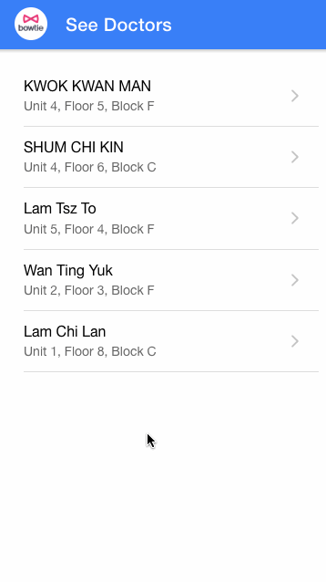

# Doctor App Project

<h2>Description of the project</h2>
The project is a Doctor Booking Page web application for patients to schedule appointments with doctors.

<h2>Specification of the app</h2>

-Users can see a doctor's profile

-Users can see a doctor's availability

-Users can make a booking

<h2>Demonstration of different steps of the app</h2>

 

<h2>App link</h2>

[Click here to visit the doctor app](https://necktie-doctor-app.web.app/doctor)

 

<h2>Answers to questions of the assessment</h2>

<ol>
<li>Choice of package</li>

Frameworks used: **Angular** and **Ionic**

<h4>a. What is the purpose/importance of the package?</h4>

**-Angular:**

-Modern and popular JS framework

**-Ionic:**

-Nice and responsive UI component(use of lists, cards, inputs, buttons, dialogues, toasters...)

<h4>b. What are the benefits & drawbacks associated with that choice?</h4>

**-Angular:**

-Improved Speed and Performance

-Programming style

**-Ionic:**

-Follow the material design recommendations

-Cross platform and creates PWA natively

-Integrates Angular natively

<h4>c. What are the assumptions underlying that choice?</h4>

Users will use this app on their smartphones and tablets.

*NB
Alternative for UI component:* 

-Angular material: Not responsive: [Angular material link](https://material.angular.io/components/categories)

-Bootstrap +bootswatch theme: Materia:  [Bootstrap link](https://bootswatch.com/materia/)

<li>Potential Improvement</li>

1/Doctor's filter

2/Authentication features

3/See and manage bookings

4/Rating for doctors

<li>Production improvement</li>

CI scripts are located on the travis.yml file.

<li>Assumtions</li>

**a.Any assumptions you have made when you designed the data model and API
schema?**

When calling the API POST /bookging, no id nor status were required on the body of the request.

**b. Any other assumptions and opinions you have taken throughout the assessments?**

-I tried to make an aesthetic, useful, simple and intuitive user interface reducing the steps to make a booking to improve the conversion rate.

-For booking logic, the booking taken is for the soonest day possible for the hour asked.

-Many icons are added to show the loading phase, showing confirmation, showing errors...

-**For amelioration,** I suggest adding the authentication features so that the user can manage his bookings.
